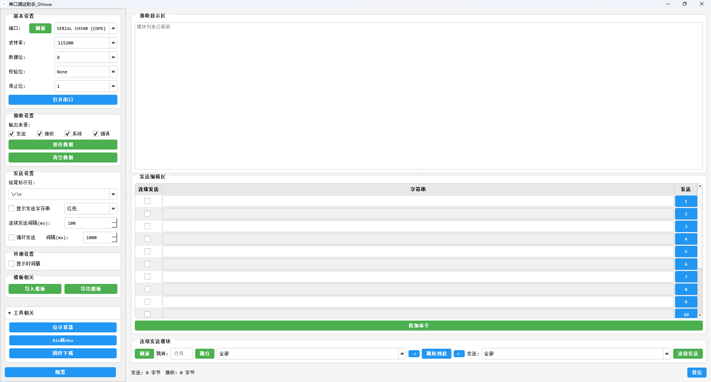

# GHowe 串口调试助手 (GHowe Serial Tool)

<p align="center">
  <strong>专为嵌入式开发者设计的高效串口调试工具</strong><br>
  <sub>版本 1.2.2 | 2026-07-14</sub>
</p>

<p align="center">
  <a href="#快速开始">快速开始</a> •
  <a href="#功能概览">功能概览</a> •
  <a href="#文档入口">文档入口</a> •
  <a href="docs/VERSION_HISTORY.md">更新历史</a> •
  <a href="docs/DEVELOPER_NOTES.md">开发文档</a>
</p>

---

## 目录

- [项目概览](#项目概览)
- [快速开始](#快速开始)
- [功能概览](#功能概览)
- [打包与入口](#打包与入口)
- [文档入口](#文档入口)
- [故障排查与支持](#故障排查与支持)

---

## 项目概览

GHowe 串口调试助手是一个功能丰富的串口调试工具，基于 PyQt5 构建，提供直观的界面、强大的命令管理、丰富的特殊指令支持，让串口调试变得简单高效。

README 只保留项目介绍、启动入口和文档导航。图形界面的具体操作、快捷键、查找、替换发送、特殊命令和命令行参数请查看下方操作手册。

### 最新更新 (v1.2.2)

- ✅ 新增接收区与发送编辑区独立查找，支持大小写、正则和全字符匹配
- ✅ 新增替换发送模式，支持全局规则、命令行独立规则和正则分组替换
- ✅ 优化发送编辑区查找体验，搜索结果高亮显示且回车可连续跳转
- ✅ 新增 GUI/CLI 两份操作手册，Help 窗口只显示操作手册，不再显示 README
- ✅ 精简 README，删除与操作手册重复的操作细节并改为文档跳转
- ✅ 优化发送设置与底部按钮布局，统一替换模式和帮助按钮视觉提示
- ✅ 调整打包资源，EXE 只打包 GUI/CLI 两份操作手册，不打包 README

👉 查看完整更新: [版本更新记录](docs/VERSION_HISTORY.md)

### 核心特性

- **智能命令管理** - 支持命令模块化组织、批量操作、模板导入导出
- **特殊指令系统** - 支持 mode、modeend、delay、SendHex、BaudRate、ComPort、SetEndlog、SendMode、StopContinuous
- **灵活的发送模式** - 支持单次发送、连续发送、循环发送和替换发送
- **独立查找能力** - 接收区和发送编辑区可分别查找，支持大小写、正则和全字符匹配
- **替换发送能力** - 支持全局规则、命令行独立规则和正则分组替换
- **智能输出过滤** - 按来源分类显示发送、接收、系统、错误，快速定位问题
- **自动状态保存** - 程序关闭时自动保存配置、命令和界面布局，下次启动自动恢复
- **远程控制** - 支持局域网主控端/远程端串口控制
- **CLI 自动化** - 支持命令行发送字符串、十六进制和部分特殊命令
- **外部工具集成** - 支持固件下载工具、进制转换器等，完整传递串口配置和 ACK 参数

### 技术特点

- 🎯 **工具注册表机制** - 集中管理所有工具配置，易于扩展
- ⚡ **非阻塞异步执行** - 使用 QTimer 实现特殊指令，UI 始终响应
- 🔄 **版本自动兼容** - 配置文件自动迁移，无需手动升级
- 🖥️ **GUI/CLI 独立入口** - 兼容版、GUI 专用版和 CLI 专用版可同时打包，默认共用同一份配置
- 🌐 **局域网远程控制** - 支持主控端/远程端协同控制串口设备
- 🎨 **模块化架构** - 清晰的代码结构，便于维护和二次开发
- 🔧 **完整串口参数** - 支持数据位、校验位、停止位完整配置传递
- 📋 **标准 CSV 处理** - 符合 RFC 4180 标准，兼容 Excel/LibreOffice

### 主界面预览

> 
>
> **界面布局说明**：
> - 左侧：命令表格区域（支持批量操作）
> - 中间：接收显示区（实时显示通信数据）
> - 右侧：配置面板（串口设置、发送设置）

### 适用场景

- **嵌入式设备调试** - GPS 模块、GSM 模块、传感器等
- **寄存器配置** - 芯片寄存器读写、参数配置
- **协议测试** - AT 指令测试、自定义通信协议验证
- **批量测试** - 设备稳定性测试、压力测试
- **自动化脚本** - 通过 CLI 执行固定串口命令或模块流程

---

## 快速开始

### 环境要求

- **Python**: 3.6+
- **操作系统**: Windows / Linux / macOS
- **依赖库**:
  - PyQt5 (≥5.15.0) - GUI 框架
  - pyserial (≥3.5) - 串口通信

### 安装依赖

```bash
pip install PyQt5 pyserial
```

如需打包可执行文件：

```bash
pip install pyinstaller
```

### 启动 GUI

```bash
cd serial_tool_project
python main.py
```

或者运行纯 GUI 入口：

```bash
python gui_main.py
```

GUI 操作、快捷键、查找、替换发送、连续发送、循环发送和特殊命令说明见 [GUI 操作手册](docs/OPERATION_MANUAL_FOR_GUI.md)。

### 启动 CLI

```bash
cd serial_tool_project
python cli_main.py --help
```

通用入口也可以进入 CLI：

```bash
python main.py --cli --port COM3 --baudrate 115200 --send "AT"
```

CLI 参数、配置文件、特殊命令支持范围和自动化示例见 [CLI 操作手册](docs/OPERATION_MANUAL_FOR_CLI.md)。

---

## 功能概览

### GUI 能力

GUI 提供完整的串口调试工作台，适合交互式调试、命令模板维护和长时间测试。

- 串口连接、断开、刷新和参数配置
- 接收显示、来源过滤、保存数据和清空数据
- 命令行编辑、批量选择、模块管理和模板导入导出
- 接收区与发送编辑区独立查找
- 全局和单行规则的替换发送
- 连续发送、循环发送和模块跳转
- 远程控制和外部工具集成

详细 GUI 操作请直接查看：[GUI 操作手册](docs/OPERATION_MANUAL_FOR_GUI.md)。

### CLI 能力

CLI 适合脚本化调用、自动化测试和 CI/本地批处理。

- 使用配置文件打开串口
- 命令行覆盖串口号和波特率
- 发送普通字符串或十六进制数据
- 执行配置中的模块
- 发送后读取设备响应
- 返回进程退出码，便于脚本判断成功或失败

完整 CLI 参数和示例请查看：[CLI 操作手册](docs/OPERATION_MANUAL_FOR_CLI.md)。

### 特殊命令

当前支持的特殊命令包括：

```text
mode, modeend, delay, SendHex, BaudRate, ComPort, SetEndlog, SendMode, StopContinuous
```

特殊命令在 GUI 和 CLI 中的支持范围不同。格式、示例和差异说明请查看：

- [GUI 操作手册 - 特殊命令](docs/OPERATION_MANUAL_FOR_GUI.md#9-特殊命令)
- [CLI 操作手册 - 特殊命令支持](docs/OPERATION_MANUAL_FOR_CLI.md#6-特殊命令支持)

---

## 打包与入口

### 打包命令

在 `serial_tool_project` 目录运行：

```bash
pyinstaller main.spec
```

### 可执行文件

| 文件 | 说明 |
|------|------|
| `GHowe_串口调试助手.exe` | 通用版，默认 GUI，支持 `--cli` |
| `GHowe_串口调试助手_GUI.exe` | 纯 GUI 版，不显示控制台 |
| `GHowe_串口调试助手_CLI.exe` | 纯 CLI 版，适合脚本和自动化 |

GUI、通用 EXE 和 CLI EXE 会打包 GUI/CLI 两份操作手册，便于随发布包分发。

GitHub Release 上传时会在扩展名前追加版本号，例如 `GHowe_串口调试助手_GUI_v1.2.2.exe`；本地执行 `pyinstaller main.spec` 时仍使用上表中的文件名。

---

## 文档入口

📚 **完整文档集**

- [🖥️ GUI 操作手册](docs/OPERATION_MANUAL_FOR_GUI.md) - 图形界面、快捷键、查找、替换发送、连续发送、特殊命令
- [⌨️ CLI 操作手册](docs/OPERATION_MANUAL_FOR_CLI.md) - 命令行启动、参数、配置、特殊命令支持范围
- [📋 版本更新记录](docs/VERSION_HISTORY.md) - 所有版本的功能变更和 Bug 修复
- [🔧 开发者笔记](docs/DEVELOPER_NOTES.md) - 架构设计、扩展开发、技术细节

在 GUI 中也可以点击左下角 `?` 或按 `F1` 打开内置帮助。内置帮助只显示 GUI 和 CLI 两份操作手册，不显示 README。

---

## 故障排查与支持

常见串口问题通常与端口占用、参数不匹配、结尾符设置或设备未就绪有关。具体操作建议请优先查看 [GUI 操作手册](docs/OPERATION_MANUAL_FOR_GUI.md#10-常见问题)。

如果需要反馈问题，建议附带：

- 工具版本和运行入口
- Python 与操作系统版本
- 串口参数和复现步骤
- 控制台错误或接收显示区错误信息
- 可公开的最小配置或模板

### 反馈与贡献

- **问题反馈**: 提交 Issue 到项目仓库
- **功能建议**: 在 Issue 中描述您的需求
- **代码贡献**: Fork 项目，提交 Pull Request
- **文档改进**: 修正错误或补充文档内容

**贡献者指南**: 参考 [开发者笔记](docs/DEVELOPER_NOTES.md#贡献指南)

---

## 许可证

本项目采用 Apache-2.0 license 开源协议。

---

<p align="center">
  <strong>GHowe 串口调试助手 - 让串口调试更简单</strong><br>
  Made with ❤️ by GHowe
</p>
